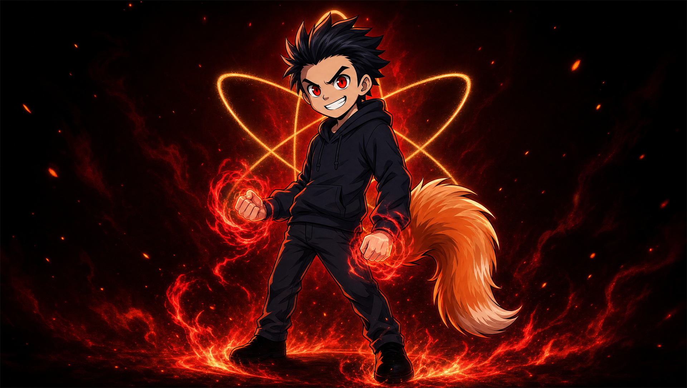
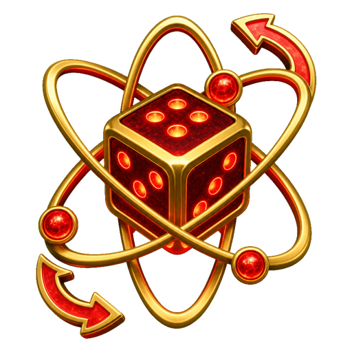

# _build8 — RYO start / menu / loading visual overhaul (patch doc)

**Scope:** `index.html` ONLY. Brand: black · crimson `#ff1f2e` · ember `#ff7a4a` · gold `#e0a93f` · chrome `#dad7d2`; warm darks. Every new asset **self-heals** (hides / falls back) so the build ships now even though `assets/levels/menu-loop.mp4`, `assets/ryo/*`, and `assets/atom-loading.png` are **not yet present** (only `assets/ui/random-stage.png` exists on disk today). Standard 6-string + GH 5-string gameplay/scoring/timing are **untouched** — this is presentation only. All motion is `reduceMotion` / `fxLite` safe (new animations are gated by the existing `html.rr-reduce-motion` rules where it matters, and the heavy video is `rr-perf-bg` + `?novideo` gated exactly like the browse-loop video).

> **Integrator:** apply in order. Do **not** bump `?v=` (you bump once at the end). After applying, `?novideo=1` should kill all three videos; Settings → Performance bg should kill the menu video; the hub must look rich with **no** assets present (pure-CSS fallbacks), and richer once assets drop in.

---

## ASSET REALITY (verified on disk 2026-06-07)
| asset | path | status | self-heal |
|---|---|---|---|
| menu bg video | `assets/levels/menu-loop.mp4` | **absent** | `<video onerror>` hides it → CSS gradient backdrop shows through |
| RYO hero still | `assets/ryo/ryo-hero.png` | **absent** (dir empty) | `` hides the hero element; layout unaffected |
| RYO intro video | `assets/ryo/ryo-intro.mp4` | **absent** | intro `onerror`/`onended`/timeout all dismiss → goes straight to hub |
| atom loader core | `assets/atom-loading.png` | **absent** (only `assets/atom.png`) | `` hides PNG → existing SVG atom remains the core |
| random-stage icon | `assets/ui/random-stage.png` | **present (302 KB)** | `onerror` swaps to a 🎲 dice glyph |

---

# PATCH 1 — START + MENU-HUB cinematic background (`menu-loop.mp4`) + RYO hero

### 1a. CSS — add the shared menu-video + RYO-hero styles (mirror the `#lib-bg-video` pattern)

**FILE:** `index.html`
**ANCHOR (unique, replace this whole block):**
```css
  html.rr-perf-bg #lib-bg-video { display: none !important; }
```
**REPLACE WITH:**
```css
  html.rr-perf-bg #lib-bg-video { display: none !important; }
  /* build8: cinematic START + MAIN-MENU backdrop — full-bleed warm loop behind the hub/console,
     mirrors #lib-bg-video (perf/novideo-gated, self-heals if the mp4 is absent). One <video>
     element is shared by #start and #menu-hub via fixed positioning behind both. */
  #menu-hub-video { position: fixed; inset: 0; width: 100%; height: 100%; object-fit: cover;
    z-index: 0; opacity: 0.42; pointer-events: none; filter: saturate(1.05) contrast(1.04); }
  html.rr-perf-bg #menu-hub-video { display: none !important; }
  /* the start screen + hub keep a warm scrim ABOVE the video but BELOW their content so text stays legible */
  #start .start-bg, #menu-hub .mh-card { position: relative; z-index: 2; }
  /* RYO hero presence — a tall character still anchored to the lower-right, tasteful, never over the tiles.
     drop-shadow gives it the crimson rim-light identity; self-heals (img hidden) if the art is absent. */
  .ryo-hero { position: absolute; right: clamp(-40px, -2vw, 0px); bottom: 0; z-index: 1; pointer-events: none;
    height: min(78vh, 720px); width: auto; max-width: 46vw; object-fit: contain; object-position: bottom right;
    filter: drop-shadow(0 0 38px rgba(255,31,46,0.42)) drop-shadow(0 10px 30px rgba(0,0,0,0.6));
    opacity: 0; animation: ryoHeroIn 1.1s cubic-bezier(.2,.8,.2,1) 0.25s both; }
  @keyframes ryoHeroIn { 0% { opacity: 0; transform: translateX(6%) scale(1.03); }
    100% { opacity: 0.92; transform: translateX(0) scale(1); } }
  /* a soft crimson uplight pooled under RYO so he reads as standing in the scene, not pasted on */
  .ryo-glow { position: absolute; right: 2vw; bottom: -8%; z-index: 0; pointer-events: none;
    width: min(60vw, 760px); height: 52vh;
    background: radial-gradient(ellipse at 70% 90%, rgba(255,31,46,0.30), rgba(163,6,15,0.10) 46%, transparent 72%);
    filter: blur(10px); animation: glowPulse 3.2s ease-in-out infinite; }
  /* keep RYO from crowding the console on narrow/short screens — fade him toward the edge or hide */
  @media (max-width: 880px) { .ryo-hero { opacity: 0.5; max-width: 40vw; height: min(62vh, 560px); }
    .ryo-glow { opacity: 0.6; } }
  @media (max-width: 620px), (max-height: 560px) { .ryo-hero, .ryo-glow { display: none; } }
  html.rr-reduce-motion .ryo-hero { animation: none; opacity: 0.9; }
  html.rr-reduce-motion .ryo-glow { animation: none; }
```
*Why:* `#menu-hub-video` is `position:fixed` so the **one** element sits behind BOTH `#start` (z-index of `.start-bg` content stays above it) and `#menu-hub`. It self-heals via the markup `onerror` (Patch 1b) and is gated by `rr-perf-bg` (Settings → Performance) + the `?novideo` block (Patch 1d), exactly like `#lib-bg-video`. The hub already has its own gradient (`.menu-hub { background: … }`), which becomes the fallback when the video is hidden.

> **z-index note (verified):** `#menu-hub` is `z-index:240`; `#start` is the active `.screen` (z-index auto within `#app`). `#menu-hub-video` at `z-index:0` is positioned `fixed` so it paints behind screen content but the screens themselves (opaque-ish gradients) sit above it. The hub's `.menu-hub { background: … }` is a gradient with alpha, so the video shows through softly — intended. If the integrator finds the hub gradient fully occludes the video, soften it in Patch 1c (provided).

### 1b. MARKUP — add the shared menu video + RYO hero to `#start` and `#menu-hub`

**FILE:** `index.html`
**ANCHOR (unique — the start screen's bg wrapper open tag):**
```html
    <div class="start-bg">
      <video id="start-video" src="assets/moon-loop.mp4" autoplay loop muted playsinline preload="auto"></video>
```
**REPLACE WITH:**
```html
    <video id="menu-hub-video" autoplay loop muted playsinline preload="auto" src="assets/levels/menu-loop.mp4" onerror="this.style.display='none'"></video>
    
    <div class="ryo-glow" aria-hidden="true"></div>
    <div class="start-bg">
      <video id="start-video" src="assets/moon-loop.mp4" autoplay loop muted playsinline preload="auto"></video>
```
*The shared `#menu-hub-video` is `position:fixed`, so placing the single element inside `#start` still has it span the viewport behind the hub too. The RYO hero + glow here are the **start-screen** instance.*

**ANCHOR (unique — the hub card open, to add RYO to the hub as well):**
```html
  <div class="screen menu-hub" id="menu-hub" data-screen-label="main-menu">
    <div class="mh-card">
```
**REPLACE WITH:**
```html
  <div class="screen menu-hub" id="menu-hub" data-screen-label="main-menu">
    
    <div class="ryo-glow" aria-hidden="true"></div>
    <div class="mh-card">
```

### 1c. CSS (optional, only if the hub gradient hides the video) — soften the hub backdrop

**FILE:** `index.html`
**ANCHOR (unique):**
```css
  .menu-hub { z-index: 240; padding: 24px; overflow-y: auto;
    background:
      radial-gradient(ellipse at 50% 22%, rgba(163,6,15,0.30), transparent 60%),
      radial-gradient(ellipse at 50% 100%, rgba(255,31,46,0.10), transparent 55%),
      linear-gradient(180deg, #0a0706 0%, #160c0b 100%); }
```
**REPLACE WITH:**
```css
  .menu-hub { z-index: 240; padding: 24px; overflow-y: auto;
    background:
      radial-gradient(ellipse at 50% 22%, rgba(163,6,15,0.34), transparent 58%),
      radial-gradient(ellipse at 18% 92%, rgba(255,31,46,0.12), transparent 52%),
      linear-gradient(180deg, rgba(10,7,6,0.82) 0%, rgba(22,12,11,0.92) 100%); }
```
*Switches the base layer from opaque `#0a0706→#160c0b` to a warm **alpha** wash (0.82→0.92) so `#menu-hub-video` reads through as a moving ambience while text stays legible. If `menu-loop.mp4` is absent, this still looks like the old solid hub (alpha over the black `body`).*

### 1d. JS — extend the `?novideo` kill-list to include the menu video

**FILE:** `index.html`
**ANCHOR (unique):**
```js
      document.querySelectorAll('#bg-video, #start-video, #lib-bg-video').forEach(function (v) {
```
**REPLACE WITH:**
```js
      document.querySelectorAll('#bg-video, #start-video, #lib-bg-video, #menu-hub-video').forEach(function (v) {
```

---

# PATCH 2 — the 6 hub tiles get a living per-tile treatment

### 2a. CSS — richer tile glow / accent / hover (replace the flat tile styles)

**FILE:** `index.html`
**ANCHOR (unique — the base `.mh-tile` rule, replace through the `.mh-tile.primary::after` rule):**
```css
  .mh-tile { position: relative; display: flex; flex-direction: column; align-items: center;
    justify-content: center; gap: 10px; min-height: 150px; padding: 22px 16px;
    border: 1px solid var(--line); border-radius: 16px; cursor: pointer;
    background: linear-gradient(180deg, rgba(28,12,14,0.6), rgba(12,6,8,0.85));
    color: var(--ink); font-family: 'Oxanium', sans-serif;
    transition: transform .14s ease, border-color .14s ease, box-shadow .14s ease, background .14s ease; }
  .mh-tile:hover, .mh-tile:focus-visible { transform: translateY(-4px); border-color: var(--crimson);
    box-shadow: 0 14px 38px rgba(0,0,0,0.5), 0 0 26px rgba(255,31,46,0.3);
    background: linear-gradient(180deg, rgba(40,14,18,0.7), rgba(16,7,9,0.9)); outline: none; }
  .mh-tile:focus-visible { outline: 2px solid var(--crimson); outline-offset: 2px; }
  .mh-tile.primary { border-color: rgba(255,42,48,0.55);
    box-shadow: 0 0 0 1px rgba(255,42,48,0.14) inset, 0 8px 26px rgba(255,31,46,0.18); }
  .mh-tile .mh-ico { width: 38px; height: 38px; color: var(--crimson);
    filter: drop-shadow(0 0 8px rgba(255,31,46,0.45)); }
  .mh-tile .mh-ico svg { width: 100%; height: 100%; }
  .mh-tile .mh-t { font-weight: 800; font-size: 18px; letter-spacing: 0.1em; text-transform: uppercase; }
  .mh-tile .mh-d { font-family: 'Chakra Petch', monospace; font-weight: 600; font-size: 10.5px;
    letter-spacing: 0.06em; color: var(--ink-dim); text-transform: uppercase; }
  .mh-tile.primary::before, .mh-tile.primary::after { content: ''; position: absolute; width: 16px;
    height: 16px; border: 1px solid var(--crimson); opacity: 0.7; }
  .mh-tile.primary::before { top: -1px; left: -1px; border-right: none; border-bottom: none; }
  .mh-tile.primary::after { bottom: -1px; right: -1px; border-left: none; border-top: none; }
```
**REPLACE WITH:**
```css
  /* build8: living tiles — per-tile accent (--ta), a soft radial bloom that wakes on hover,
     a glass top-sheen, and an animated accent hairline along the top edge. Default --ta=crimson;
     each tile overrides it below so the grid reads as six distinct "instruments", not one flat slab. */
  .mh-tile { position: relative; display: flex; flex-direction: column; align-items: center;
    justify-content: center; gap: 10px; min-height: 150px; padding: 22px 16px; overflow: hidden;
    --ta: var(--crimson);
    border: 1px solid var(--line); border-radius: 16px; cursor: pointer;
    background:
      radial-gradient(120% 80% at 50% -10%, color-mix(in srgb, var(--ta) 18%, transparent), transparent 60%),
      linear-gradient(180deg, rgba(28,12,14,0.62), rgba(12,6,8,0.88));
    color: var(--ink); font-family: 'Oxanium', sans-serif;
    transition: transform .16s cubic-bezier(.2,.8,.2,1), border-color .16s ease, box-shadow .16s ease, background .16s ease; }
  /* glass sheen sweep + bottom accent pool (the "living" layer; pointer-events:none so clicks pass) */
  .mh-tile::before { content: ''; position: absolute; inset: 0; border-radius: inherit; pointer-events: none;
    background:
      linear-gradient(180deg, rgba(255,255,255,0.07), transparent 26%),
      radial-gradient(90% 60% at 50% 118%, color-mix(in srgb, var(--ta) 32%, transparent), transparent 70%);
    opacity: 0.5; transition: opacity .18s ease; }
  /* animated accent hairline across the top edge — subtle drift, brightens on hover */
  .mh-tile::after { content: ''; position: absolute; top: 0; left: 12%; right: 12%; height: 2px; pointer-events: none;
    background: linear-gradient(90deg, transparent, var(--ta), transparent);
    opacity: 0.35; filter: drop-shadow(0 0 6px var(--ta));
    background-size: 200% 100%; animation: mhEdge 5.5s linear infinite; }
  @keyframes mhEdge { 0% { background-position: 0% 0; } 100% { background-position: 200% 0; } }
  .mh-tile:hover, .mh-tile:focus-visible { transform: translateY(-5px) scale(1.012); border-color: var(--ta);
    box-shadow: 0 16px 42px rgba(0,0,0,0.55), 0 0 30px color-mix(in srgb, var(--ta) 42%, transparent);
    background:
      radial-gradient(120% 90% at 50% -10%, color-mix(in srgb, var(--ta) 30%, transparent), transparent 62%),
      linear-gradient(180deg, rgba(40,16,20,0.72), rgba(16,7,9,0.92)); outline: none; }
  .mh-tile:hover::before, .mh-tile:focus-visible::before { opacity: 1; }
  .mh-tile:hover::after, .mh-tile:focus-visible::after { opacity: 0.9; }
  .mh-tile:focus-visible { outline: 2px solid var(--ta); outline-offset: 2px; }
  .mh-tile.primary { border-color: color-mix(in srgb, var(--ta) 60%, transparent);
    box-shadow: 0 0 0 1px color-mix(in srgb, var(--ta) 16%, transparent) inset, 0 10px 30px color-mix(in srgb, var(--ta) 22%, transparent); }
  /* icon sits ABOVE the ::before sheen (z-index) and glows in the tile's own accent */
  .mh-tile .mh-ico { position: relative; z-index: 1; width: 40px; height: 40px; color: var(--ta);
    filter: drop-shadow(0 0 10px color-mix(in srgb, var(--ta) 55%, transparent));
    transition: transform .16s cubic-bezier(.2,.8,.2,1); }
  .mh-tile:hover .mh-ico, .mh-tile:focus-visible .mh-ico { transform: translateY(-2px) scale(1.08); }
  .mh-tile .mh-ico svg { width: 100%; height: 100%; }
  .mh-tile .mh-t { position: relative; z-index: 1; font-weight: 800; font-size: 18px; letter-spacing: 0.1em; text-transform: uppercase; }
  .mh-tile .mh-d { position: relative; z-index: 1; font-family: 'Chakra Petch', monospace; font-weight: 600; font-size: 10.5px;
    letter-spacing: 0.06em; color: var(--ink-dim); text-transform: uppercase; }
  /* per-tile accent identity (the six instruments). IDs match the markup. */
  #mh-campaign    { --ta: var(--crimson); }   /* hero path — crimson */
  #mh-quickplay   { --ta: #ff7a4a; }          /* ember — fast/play */
  #mh-multiplayer { --ta: #e0a93f; }          /* gold — versus */
  #mh-store       { --ta: #e0a93f; }          /* gold — currency */
  #mh-leaderboard { --ta: #dad7d2; }          /* chrome — ranks */
  #mh-profile     { --ta: var(--crimson); }   /* crimson — your career */
  .mh-tile.primary::before { opacity: 0.7; }
  /* reduced-motion / fxLite: freeze the drifting edge + sheen to a calm static state */
  html.rr-reduce-motion .mh-tile::after { animation: none; opacity: 0.45; }
  body.rr-fx-lite .mh-tile::after { animation: none; }
```
*Notes:* `color-mix()` has full coverage on the user's Chrome. Clicks pass through `::before`/`::after` (`pointer-events:none`) and content carries `z-index:1`, so the existing hub router wiring (`mh-campaign`, etc., in the router IIFE) is unaffected. The old `.mh-tile.primary::before/::after` corner-brackets are intentionally **replaced** by the new sheen treatment — the primary tile now reads via its crimson bloom + heavier shadow instead of corner ticks (cleaner, less busy). If you want the brackets back, they can be re-added on `.mh-tile.primary` with a separate inset box-shadow; not required.

> `body.rr-fx-lite` — confirm the fxLite class name. The codebase toggles `html.rr-reduce-motion` for sure (verified). If fxLite uses a different hook, the `body.rr-fx-lite` line is a harmless no-op; the reduce-motion line is the load-bearing one.

---

# PATCH 3 — LOADING screen uses `atom-loading.png` as the pulsing core

### 3a. MARKUP — drop the PNG core into the loader (self-heals to the SVG atom)

**FILE:** `index.html`
**ANCHOR (unique — the atom loader wrapper open + halo):**
```html
      <div class="atom-loader">
        <span class="atom-halo" aria-hidden="true"></span>
```
**REPLACE WITH:**
```html
      <div class="atom-loader">
        <span class="atom-halo" aria-hidden="true"></span>
        
```
*`onerror="this.remove()"` (not just hide) so when the PNG is absent the existing animated **SVG** atom is the loader, untouched. When the PNG is present it becomes the spinning/dripping/pulsing core layered over the SVG orbits + progress ring.*

### 3b. CSS — style + animate the PNG core (spin + pulse, reduce-motion safe)

**FILE:** `index.html`
**ANCHOR (unique — end of the atom loader sweep/chrome block; insert AFTER this rule):**
```css
  .atom-svg { position: relative; z-index: 1; width: 100%; height: 100%; overflow: visible; }
```
**INSERT AFTER IT:**
```css
  /* build8: optional raster atom core (assets/atom-loading.png) — sits centered over the SVG,
     spins slowly + pulses (the "energy core"). Self-heals: img is removed onerror, leaving the SVG. */
  .atom-img { position: absolute; left: 50%; top: 50%; z-index: 2; pointer-events: none;
    width: 46%; height: 46%; object-fit: contain;
    transform: translate(-50%, -50%);
    filter: drop-shadow(0 0 18px rgba(255,31,46,0.7)) drop-shadow(0 0 36px rgba(255,122,74,0.35));
    animation: atomImgSpin 9s linear infinite, atomImgPulse 1.05s ease-in-out infinite; }
  @keyframes atomImgSpin  { to { transform: translate(-50%, -50%) rotate(360deg); } }
  @keyframes atomImgPulse {
    0%,100% { opacity: 0.92; filter: drop-shadow(0 0 14px rgba(255,31,46,0.65)) drop-shadow(0 0 28px rgba(255,122,74,0.30)); }
    50%     { opacity: 1;    filter: drop-shadow(0 0 26px rgba(255,31,46,1))    drop-shadow(0 0 48px rgba(255,122,74,0.55)); }
  }
  /* spin + pulse compose on one element via two @keyframes; reduce-motion freezes both to a clean frame */
  html.rr-reduce-motion .atom-img { animation: none; transform: translate(-50%, -50%); opacity: 0.95; }
  @media (prefers-reduced-motion: reduce) { .atom-img { animation: none; transform: translate(-50%, -50%); opacity: 0.95; } }
```
*Caveat (important):* an element can't have **two** independent `transform` animations — `atomImgSpin` owns `transform`, and `atomImgPulse` only animates `opacity`/`filter` (it does **not** touch transform), so they compose cleanly. This is why pulse is opacity/glow, not scale. (A scale-pulse would fight the spin's transform.) This also keeps it `reduce-motion` correct.

> The PNG core is **smaller than** the SVG nucleus area (`46%`) so the SVG's three orbiting electrons + the crimson progress ring (`#loading-ring`, which still fills with decode progress) stay fully visible around it. The existing `.atom-core` SVG nucleus sits beneath the PNG — when the PNG loads it visually replaces the plain SVG drum with the richer raster core; when absent, the SVG drum remains.

---

# PATCH 4 — DEFAULT chip becomes **RANDOM STAGE** (rolls a random environment each play)

The env-picker IIFE (`<script>` at the bottom) builds chips from `window.RhythmLevels.environments()`, whose first entry is `{ id:'__default', name:'Default', isDefault:true, … }`. We (a) rename/retag that entry to **Random** + give it the dice icon, (b) make the play-time wrap **roll a real random environment** when Random is staged.

### 4a. JS — rename the Default environment to "Random" (source of truth)

**FILE:** `index.html`
**ANCHOR (unique — the environments() default entry):**
```js
      var list = [{ id:'__default', name:'Default', tier:'', theme:'', accent:'#ff1f2e', cover:'', bgArt:'', bgVideo:'', reactiveCards:null, boss:false, paid:false, isDefault:true }];
```
**REPLACE WITH:**
```js
      var list = [{ id:'__default', name:'Random', tier:'', theme:'', accent:'#ff1f2e', cover:'', bgArt:'', bgVideo:'', reactiveCards:null, boss:false, paid:false, isDefault:true, isRandom:true }];
```

### 4b. JS — RANDOM picks a real environment at play time (replace the staged-env wrap branch)

**FILE:** `index.html`
**ANCHOR (unique — inside the `setMenuPlayHandler` wrap):**
```js
            var L = window.RhythmLevels;
            if (L) {
              if (selectedEnvId && selectedEnvId !== '__default') L.applyEnvironment(selectedEnvId);
              else L.clearEnvironment();
            }
```
**REPLACE WITH:**
```js
            var L = window.RhythmLevels;
            if (L) {
              if (selectedEnvId === '__default') {
                /* build8 RANDOM STAGE: roll a real, unlocked environment for this run (excludes
                   the Random sentinel + any locked/paid envs). Falls back to standard if none. */
                var pick = '';
                try {
                  var dev = false; try { dev = localStorage.getItem('rr_dev') === '1'; } catch (e0) {}
                  var pool = (L.environments ? L.environments() : []).filter(function (x) {
                    return x && !x.isDefault && !x.isRandom && !(x.paid && !dev);
                  });
                  if (pool.length) pick = pool[Math.floor(Math.random() * pool.length)].id;
                } catch (e1) {}
                if (pick) { try { L.applyEnvironment(pick); } catch (e2) { L.clearEnvironment(); } }
                else L.clearEnvironment();
              } else if (selectedEnvId) {
                L.applyEnvironment(selectedEnvId);
              } else {
                L.clearEnvironment();
              }
            }
```
*Gameplay safety:* a rolled environment goes through the **same** `applyEnvironment` → synthetic-level path the manual chips already use; it only changes **theme/skin/backdrop**, never lane count / scoring / timing. If the pool is empty (no authored envs, or all locked) it falls back to `clearEnvironment()` = byte-identical standard arena. So "Random" can never produce an unplayable or off-spec chart.

### 4c. JS — give the Random chip the dice/random-stage icon + a "rolls each play" tag

**FILE:** `index.html`
**ANCHOR (unique — the chip() body builder, replace these three lines):**
```js
    var artBg = e.cover ? ("background-image:url('" + e.cover.replace(/'/g, '') + "');") : '';
    var ini = (e.name || '?').trim().charAt(0).toUpperCase();
    var tag = e.isDefault ? 'QUICK PLAY' : ((e.boss ? 'BOSS · ' : '') + (e.theme || '').toUpperCase());
    b.innerHTML =
      '<div class="ec-art" style="' + artBg + '">' + (e.cover ? '' : '<span class="ec-ini">' + ini + '</span>') +
        (e.locked ? '<span class="ec-lock">🔒</span>' : '') + '</div>' +
      '<div class="ec-body"><div class="ec-name">' + escAttr(e.name) + '</div><div class="ec-tag">' + escAttr(tag) + '</div></div>';
```
**REPLACE WITH:**
```js
    var isRand = !!(e.isRandom || e.isDefault);
    var artBg = e.cover ? ("background-image:url('" + e.cover.replace(/'/g, '') + "');") : '';
    var ini = (e.name || '?').trim().charAt(0).toUpperCase();
    var tag = isRand ? 'ROLLS EACH PLAY' : ((e.boss ? 'BOSS · ' : '') + (e.theme || '').toUpperCase());
    /* RANDOM STAGE gets the random-stage icon (self-heals to a 🎲 glyph if the PNG is absent) */
    var artInner = isRand
      ? ('\u{1F3B2}</span>\'" />')
      : (e.cover ? '' : '<span class="ec-ini">' + ini + '</span>');
    b.innerHTML =
      '<div class="ec-art" style="' + (isRand ? '' : artBg) + '">' + artInner +
        (e.locked ? '<span class="ec-lock">🔒</span>' : '') + '</div>' +
      '<div class="ec-body"><div class="ec-name">' + escAttr(e.name) + '</div><div class="ec-tag">' + escAttr(tag) + '</div></div>';
```
*The `onerror` rewrites the `` into a dice-glyph `<span class="ec-ini">🎲</span>` so the chip always shows something on brand. (`assets/ui/random-stage.png` is already on disk, so the PNG path is the normal case.)*

### 4d. JS — hint copy for the Random chip (so it reads as a feature, not "no theme")

**FILE:** `index.html`
**ANCHOR (unique — inside select()):**
```js
    if (e && !e.isDefault) setHint('Play this song in the “' + e.name + '” environment' + (e.reactiveCards ? ' (reactive cards).' : '.'));
    else setHint('Standard arena — no level theme.');
```
**REPLACE WITH:**
```js
    if (e && (e.isRandom || e.isDefault)) setHint('Random Stage — a different environment is rolled every time you play.');
    else if (e && !e.isDefault) setHint('Play this song in the “' + e.name + '” environment' + (e.reactiveCards ? ' (reactive cards).' : '.'));
    else setHint('Standard arena — no level theme.');
```

### 4e. CSS — style the random-stage chip icon

**FILE:** `index.html`
**ANCHOR (unique — the env-chip art-initial rule; insert AFTER it):**
```css
  .env-chip .ec-art .ec-ini { font-family: 'Unbounded', sans-serif; font-weight: 700; font-size: 22px;
```
> The rule above continues onto its next line; match it by this first line and **insert a new rule after the full declaration closes**. To be safe, use the anchor below instead (the `::after` overlay rule that immediately follows the art block) and insert BEFORE it:

**ANCHOR (unique, insert the new rule BEFORE this one):**
```css
  .env-chip .ec-art::after { content: ''; position: absolute; inset: 0;
```
**INSERT BEFORE IT:**
```css
  /* build8: RANDOM STAGE chip icon (assets/ui/random-stage.png), centered + glowing in the art slot */
  .env-chip .ec-art .ec-rand { position: absolute; left: 50%; top: 50%; transform: translate(-50%, -50%);
    width: 64%; height: 64%; object-fit: contain; z-index: 1;
    filter: drop-shadow(0 0 10px rgba(255,31,46,0.6)); }
  .env-chip:hover .ec-art .ec-rand { animation: randRoll 0.6s cubic-bezier(.3,1.4,.4,1); }
  @keyframes randRoll { 0% { transform: translate(-50%,-50%) rotate(0); } 100% { transform: translate(-50%,-50%) rotate(180deg); } }
  html.rr-reduce-motion .env-chip:hover .ec-art .ec-rand { animation: none; }
```

---

# PATCH 5 (optional) — first-run RYO intro (`ryo-intro.mp4`), skippable, once via localStorage

Plays a full-screen video **before** the hub on the very first visit, then never again. Robust self-heal: if the file is absent, errors, or doesn't start within 1.2 s, it dismisses straight to the hub. The user can skip with a button, click, Esc, or Enter/Space. This patch is **purely additive** — it does not touch the existing `enter()` logic; it intercepts the `RhythmHub.show()` entry point once.

### 5a. MARKUP — add the intro overlay (insert right before the start-screen `<script>` that stamps the version, i.e. right after `#start` closes)

**FILE:** `index.html`
**ANCHOR (unique — the closing of `#start` and the stamp script open):**
```html
  </div>
  <script>
    /* Stamp the start screen with the live build version (from game.js?v=NN) + host, so a screenshot
```
**REPLACE WITH:**
```html
  </div>

  <!-- build8: first-run RYO intro (assets/ryo/ryo-intro.mp4) — skippable, shows once via localStorage.
       Self-heals: absent/erroring/slow video → dismisses straight to the hub. -->
  <div class="screen ryo-intro-screen" id="ryo-intro" aria-hidden="true">
    <video id="ryo-intro-video" muted playsinline preload="auto" src="assets/ryo/ryo-intro.mp4"></video>
    <div class="ryo-intro-scrim"></div>
    <button class="ryo-intro-skip" id="ryo-intro-skip" type="button">SKIP ›</button>
  </div>
  <script>
    /* Stamp the start screen with the live build version (from game.js?v=NN) + host, so a screenshot
```

### 5b. CSS — intro overlay styles (insert after the start-screen block, before the MAIN MENU HUB CSS)

**FILE:** `index.html`
**ANCHOR (unique — the hub-CSS section header; insert BEFORE it):**
```css
  /* ============ MAIN MENU HUB (guided console) ============ */
```
**INSERT BEFORE IT:**
```css
  /* ============ build8: FIRST-RUN RYO INTRO ============ */
  .ryo-intro-screen { z-index: 300; background: #000; opacity: 0; pointer-events: none; transition: opacity 0.4s ease; }
  .ryo-intro-screen.active { opacity: 1; pointer-events: auto; }
  #ryo-intro-video { position: absolute; inset: 0; width: 100%; height: 100%; object-fit: cover; z-index: 0; background: #000; }
  .ryo-intro-scrim { position: absolute; inset: 0; z-index: 1; pointer-events: none;
    background: radial-gradient(ellipse at 50% 50%, transparent 60%, rgba(0,0,0,0.55) 100%); }
  .ryo-intro-skip { position: absolute; right: max(calc(env(safe-area-inset-right,0px) + 18px), 22px);
    bottom: max(calc(env(safe-area-inset-bottom,0px) + 18px), 22px); z-index: 2;
    padding: 10px 18px; border-radius: 999px; cursor: pointer;
    background: rgba(12,6,8,0.6); border: 1px solid rgba(218,215,210,0.3); color: var(--ink);
    font-family: 'JetBrains Mono', monospace; font-size: 12px; letter-spacing: 0.2em; text-transform: uppercase;
    backdrop-filter: blur(8px); transition: border-color .15s ease, box-shadow .15s ease, color .15s ease; }
  .ryo-intro-skip:hover, .ryo-intro-skip:focus-visible { border-color: var(--crimson); color: var(--chrome);
    box-shadow: 0 0 16px rgba(255,31,46,0.35); outline: none; }
```

### 5c. JS — intercept `RhythmHub.show()` once on first run (insert just before the closing `})();` of the HUB router IIFE)

**FILE:** `index.html`
**ANCHOR (unique — the end of the hub router IIFE; insert BEFORE this exact block):**
```js
  try { window.RhythmHub = { show: showHub, toLibrary: toLibrary, toMultiplayer: toMultiplayer }; } catch (e) {}
})();
</script>
</body>
```
**INSERT BEFORE IT (i.e. right after the `keydown` Escape handler, before the `RhythmHub` export):**
```js
  // build8: first-run RYO intro — wrap showHub so the FIRST time we'd show the hub, we play
  // ryo-intro.mp4 first (skippable, once). Self-heals to going straight to the hub.
  (function () {
    var SEEN = 'rr_ryo_intro_seen';
    var introEl = $('ryo-intro'), vid = $('ryo-intro-video'), skipBtn = $('ryo-intro-skip');
    var reduce = false;
    try { reduce = document.documentElement.classList.contains('rr-reduce-motion') ||
      (window.matchMedia && window.matchMedia('(prefers-reduced-motion: reduce)').matches); } catch (e) {}
    var alreadySeen = true;
    try { alreadySeen = localStorage.getItem(SEEN) === '1'; } catch (e) {}
    // dev flag to force-replay: ?ryo=replay  (test-only; strip with other ?flags before launch)
    try { if (/[?&]ryo=replay/.test(location.search)) alreadySeen = false; } catch (e) {}
    if (!introEl || !vid || alreadySeen || reduce) return;   // no overlay / already seen / reduced-motion → normal hub

    var _origShow = showHub, done = false, watchdog = 0;
    function finish() {
      if (done) return; done = true;
      try { localStorage.setItem(SEEN, '1'); } catch (e) {}
      if (watchdog) { clearTimeout(watchdog); watchdog = 0; }
      try { vid.pause(); } catch (e) {}
      introEl.classList.remove('active'); introEl.setAttribute('aria-hidden', 'true');
      _origShow();   // now reveal the hub
    }
    showHub = function () {
      if (done) { _origShow(); return; }
      // hide any current screen, show the intro overlay
      try { ['start', 'menu', 'multiplayer-screen'].forEach(function (id) { var el = $(id); if (el) el.classList.remove('active'); }); } catch (e) {}
      introEl.classList.add('active'); introEl.setAttribute('aria-hidden', 'false');
      var p; try { p = vid.play(); } catch (e) { p = null; }
      if (p && p.catch) p.catch(function () { finish(); });   // autoplay blocked → skip
      // if the video can't start within 1.2s (missing/slow), bail to the hub
      watchdog = setTimeout(function () { if (vid.readyState < 2) finish(); }, 1200);
    };
    vid.addEventListener('ended', finish);
    vid.addEventListener('error', finish);
    if (skipBtn) skipBtn.addEventListener('click', finish);
    introEl.addEventListener('pointerdown', function (e) { if (e.target === skipBtn) return; finish(); });
    window.addEventListener('keydown', function (e) {
      if (!introEl.classList.contains('active')) return;
      if (e.key === 'Escape' || e.key === 'Enter' || e.code === 'Space' || e.key === ' ') { e.preventDefault(); e.stopImmediatePropagation(); finish(); }
    }, true);
  })();
```
*Why this seam:* `enter()` (start-screen IIFE) calls `window.RhythmHub.show()` to advance from `#start` → hub, and the router IIFE is defined **after** the start IIFE in source, so reassigning the local `showHub` here is safe and the export below picks up the wrapped version. The intro is skipped entirely under reduce-motion, when already seen, or if the asset is missing/blocked — so it never blocks the user from reaching the hub.

> **Strip-before-launch:** the `?ryo=replay` and `?intro=replay` dev flags + `__rr*` hooks are test-only per CLAUDE.md.

---

## VERIFY (integrator)
1. `node --check` is N/A (HTML); instead boot via Claude_Preview (`rhythm-rift`), `location.href + '?cb=' + Date.now()`.
2. **No assets present** (today's state): hub + start show the warm gradient (no broken-image icons), tiles are richly lit per-accent, loader is the SVG atom, Random chip shows the random-stage PNG (it IS on disk) with "ROLLS EACH PLAY", picking Random + Quick Play launches a standard run. Console clean (check `preview_console_logs` level error).
3. **`?novideo=1`** → `#menu-hub-video` (+ existing two) hidden.
4. **Settings → Background → Performance** → `#menu-hub-video` hidden (CSS `rr-perf-bg`).
5. **`?ryo=replay`** → tap start → intro overlay appears; SKIP / Esc / click dismisses to hub; reload (without flag) → goes straight to hub (localStorage `rr_ryo_intro_seen`).
6. Drop `menu-loop.mp4`, `ryo-hero.png`, `atom-loading.png`, `ryo-intro.mp4` into place → each lights up with no further code change.

---

# 5-LINE SUMMARY
1. **Start + Main-Menu hub** get a full-bleed cinematic `assets/levels/menu-loop.mp4` backdrop (one shared `position:fixed` `#menu-hub-video`, warm-scrimmed, gated by `rr-perf-bg` + `?novideo` exactly like the browse loop) plus a lower-right **RYO hero** (`assets/ryo/ryo-hero.png`) with a crimson uplight — both self-heal if absent.
2. The **6 hub tiles** become "living instruments": per-tile accent var (`--ta`: crimson/ember/gold/chrome), a hover-waking radial bloom, a glass sheen, and a drifting accent hairline — reduce-motion/fxLite frozen.
3. The **loading** screen layers `assets/atom-loading.png` as a spinning + glow-pulsing energy core over the existing SVG atom/progress-ring (`onerror→remove` falls back to the pure SVG; spin owns transform, pulse owns opacity/filter so they compose).
4. The env-picker **Default chip is now "RANDOM STAGE"** (`assets/ui/random-stage.png` icon, self-heals to a 🎲): it rolls a real unlocked environment at play time via the existing `applyEnvironment` path (theme/skin/backdrop only — gameplay/scoring/timing byte-identical; empty pool → standard arena).
5. **Optional first-run RYO intro** (`assets/ryo/ryo-intro.mp4`) plays once before the hub by wrapping `RhythmHub.show()`; skippable (button/click/Esc/Enter), gated to once via `localStorage.rr_ryo_intro_seen`, skipped under reduce-motion, and self-heals (missing/blocked/slow → straight to hub).

## ANCHORS USED (exact current strings, all in `index.html`)
- P1a CSS: `html.rr-perf-bg #lib-bg-video { display: none !important; }`
- P1b markup A: `<div class="start-bg">` + `<video id="start-video" src="assets/moon-loop.mp4" autoplay loop muted playsinline preload="auto"></video>`
- P1b markup B: `<div class="screen menu-hub" id="menu-hub" data-screen-label="main-menu">` + `<div class="mh-card">`
- P1c CSS (optional): `.menu-hub { z-index: 240; padding: 24px; overflow-y: auto;` … `linear-gradient(180deg, #0a0706 0%, #160c0b 100%); }`
- P1d JS: `document.querySelectorAll('#bg-video, #start-video, #lib-bg-video').forEach(function (v) {`
- P2a CSS: `.mh-tile { position: relative; display: flex; flex-direction: column; align-items: center;` … through `.mh-tile.primary::after { bottom: -1px; right: -1px; border-left: none; border-top: none; }`
- P3a markup: `<div class="atom-loader">` + `<span class="atom-halo" aria-hidden="true"></span>`
- P3b CSS insert-after: `.atom-svg { position: relative; z-index: 1; width: 100%; height: 100%; overflow: visible; }`
- P4a JS: `var list = [{ id:'__default', name:'Default', tier:'', theme:'', accent:'#ff1f2e', cover:'', bgArt:'', bgVideo:'', reactiveCards:null, boss:false, paid:false, isDefault:true }];`
- P4b JS: the `var L = window.RhythmLevels;` … `else L.clearEnvironment();` block inside `setMenuPlayHandler`
- P4c JS: `var artBg = e.cover ? ("background-image:url('" + e.cover.replace(/'/g, '') + "');") : '';` … through the `b.innerHTML = …` chip body
- P4d JS: `if (e && !e.isDefault) setHint('Play this song in the “' + e.name + '” environment'…` + `else setHint('Standard arena — no level theme.');`
- P4e CSS insert-before: `.env-chip .ec-art::after { content: ''; position: absolute; inset: 0;`
- P5a markup: `</div>` + `<script>` + `/* Stamp the start screen with the live build version (from game.js?v=NN) + host, so a screenshot`
- P5b CSS insert-before: `/* ============ MAIN MENU HUB (guided console) ============ */`
- P5c JS insert-before: `try { window.RhythmHub = { show: showHub, toLibrary: toLibrary, toMultiplayer: toMultiplayer }; } catch (e) {}` + `})();` + `</script>` + `</body>`

## SELF-HEAL / ASSET NOTES
- **On disk now:** only `assets/ui/random-stage.png` (302 KB). **Absent:** `assets/levels/menu-loop.mp4`, `assets/ryo/ryo-hero.png`, `assets/ryo/ryo-intro.mp4`, `assets/atom-loading.png` (`assets/ryo/` dir exists but is empty). Every reference uses `onerror` (hide / `remove()` / glyph-swap) so the build ships clean today and each asset "lights up" on drop-in with no further edits.
- **Verified code facts used:** `rr-perf-bg` is toggled in `game.js:1022` (`applyBgMode`, Settings → Performance) and the browse video uses `html.rr-perf-bg #lib-bg-video { display:none !important; }` — the new `#menu-hub-video` mirrors this. `?novideo` block lives at `index.html` ~3539. `enter()` (start IIFE) routes to `window.RhythmHub.show()` (defined in the later router IIFE), which is why Patch 5 wraps `showHub` there. Env picker: `environments()` default entry, `chip()`, `select()`, and the `setMenuPlayHandler` wrap are all in the env-picker IIFE; `applyEnvironment()` builds a synthetic level (theme/skin/backdrop only) so a random roll never alters gameplay/scoring/timing.
- **fxLite hook:** confirmed `html.rr-reduce-motion` exists; `body.rr-fx-lite` in Patch 2a is a defensive no-op if the project's fxLite class differs (the reduce-motion rule is the load-bearing one). Integrator: if fxLite uses another class, swap that one selector.
